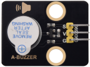
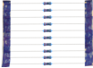
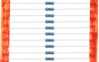

# 产品清单

当收到这个Keyes 触摸检测套件的时候，首先看到是一个包装精美的外盒，每个配件被安全且有序的装在外盒里面的小袋子里，先来清点一下：

| 序号 | 名称 | 数量 | 图片 |
| :--: | :--: | :--: | :--: |
| 1 | 面包板 | 1 | |
| 2 | 电容触摸传感器 | 1 |  |
| 3 | 5V 单路继电器模块 | 1 |  |
| 4 | 有源蜂鸣器模块 | 1 |  |
| 5  |面包板专用电源模块|1||
| 6 | 220Ω电阻 | 10 |  |
| 7 | 1KΩ电阻 | 10 | |
| 8 | 红色LED | 5 ||
| 9 | 黄色LED | 5 | |
| 10 | 蓝色LED | 5 | |
| 11 | 绿色LED | 5 | |
| 12 | 白色LED | 5 | |
| 13 | 一字型螺丝刀  | 1 ||
| 14 |公对母杜邦线|1| |
| 15 |母对母杜邦线|1| |
| 16 | 面包板连接线 | 1 | |
| 17 |电阻卡 | 1 | |
| 18| 电源适配器 | 1 | |
